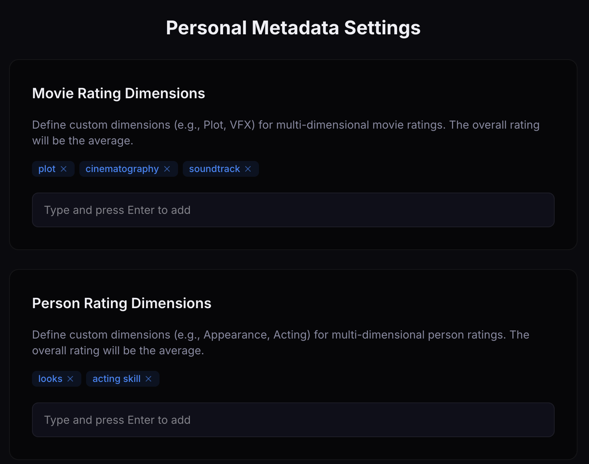
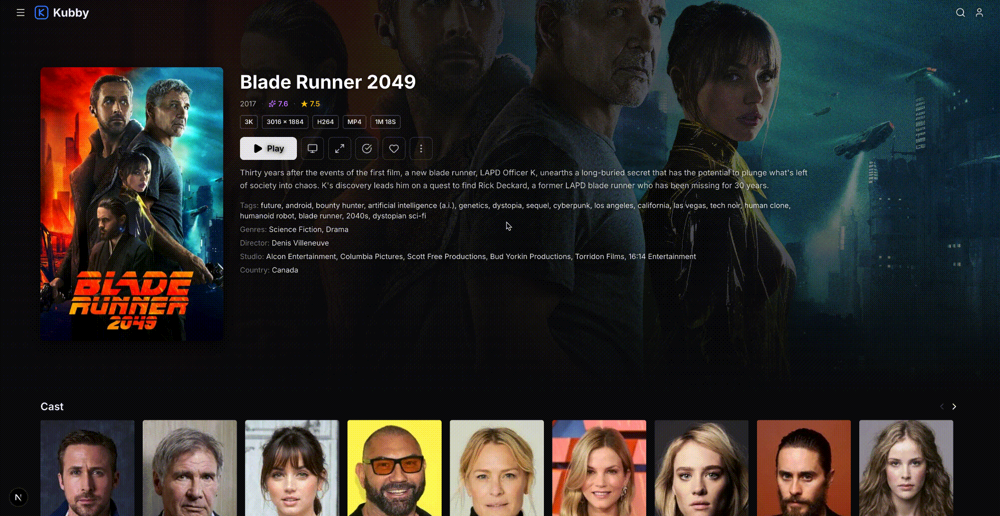
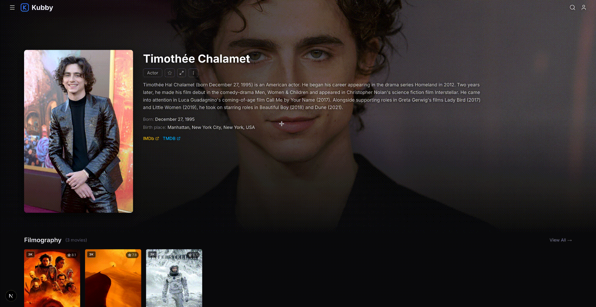
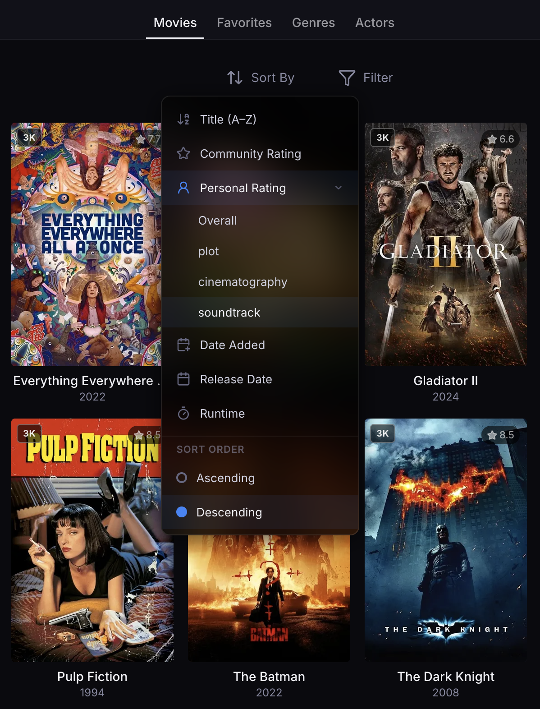
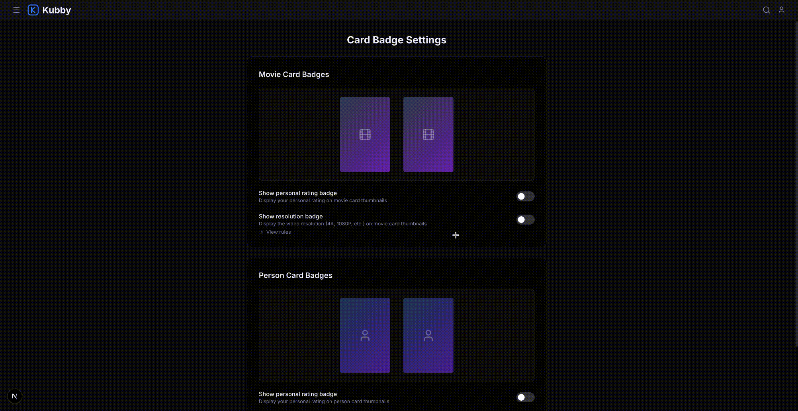
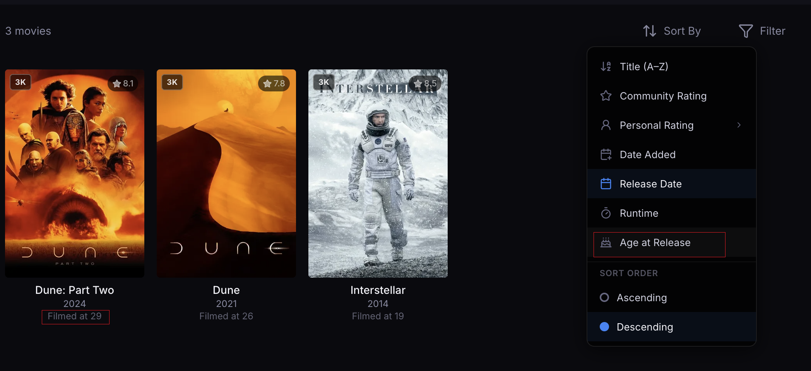
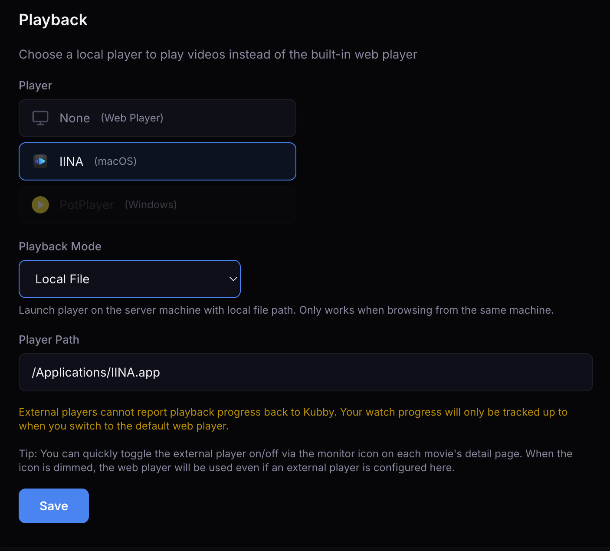
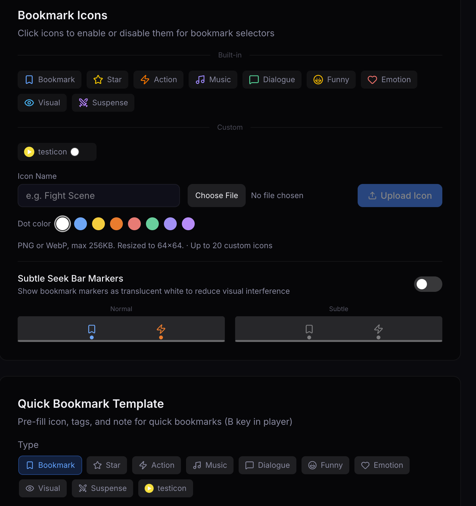

[English](README.md) | [中文](README.zh-CN.md)

# Kubby

A self-hosted movie server inspired by Jellyfin, reimagined with a modern tech stack. Built with Next.js.

I've been using Jellyfin since 2022 and check the release notes every week, hoping to see long-requested features finally land. Unfortunately, development moves very slowly — for example, the highly requested lazy loading feature was first proposed in 2020 and still hasn't been implemented. That's understandable given Jellyfin's history: it evolved from Media Browser to Emby to Jellyfin over many years, so every change has ripple effects. So I decided to rebuild a similar local media system from scratch using AI and a modern tech stack — that's how Kubby was born.

The UI was designed with [Kiro](https://kiro.dev) + [Pencil](https://pencil.dev) (vibe design tool). All code was written by [Claude Code](https://claude.ai/claude-code) (with AWS Bedrock API) + Kiro. I didn't write a single line of code. Feature suggestions and discussions are always welcome!

> **Important:** If you share a media library with Jellyfin, enable **Jellyfin Compatibility Mode** when adding the library (available in the setup wizard and library settings). Without it, Kubby will write and modify NFO files in your library folders, which can overwrite Jellyfin's metadata. With compatibility mode on, Kubby treats the library as read-only (no NFO writes) and copies actor photos to its own metadata directory instead of referencing Jellyfin's local paths.


## Basics

- Jellyfin-style dark UI with familiar browse/detail/play layout
- Drop-in compatible with existing Jellyfin and Kodi movie libraries (NFO + folder structure)
- TMDB scraper for automatic metadata, posters, actor photos, and biographies
- In-browser playback with progress tracking and multi-disc support
- English / Chinese interface

## What Kubby adds

### Multi-dimension ratings

Define your own rating dimensions for movies (plot, cinematography, soundtrack, ...) and actors (looks, acting skill, ...). Scores average into an overall rating that maps to a tier (SSS/S/A/B/...) on cards. You can sort your entire library by any single dimension, so finding "best cinematography" or "best acting skill" is one click.









### Poster and actor badges

Personal rating, resolution (4K/1080p/etc.), and actor tier show directly on cards. Turn off the ones you don't care about in settings.



### Actor photo gallery

Upload photos for actors. Justified row layout (like Google Photos) with a lightbox viewer.


### Filmography sorted by age

Actor detail pages show how old they were in each film. Sort by age to trace their career chronologically, or just to see what they looked like at 25 vs 45.



### External player

For HEVC, DTS, or anything else the browser won't play — one click opens IINA (macOS) or PotPlayer (Windows). Supports both local file mode and streaming from server.



### Video bookmarks

Press B during playback for a quick bookmark, or Shift+B to pick an icon, add tags, and write a note. Bookmarks appear as colored dots on the progress bar. 9 built-in icons, and you can upload your own. All bookmarks are browsable from the movie detail page.




### Search with categories

One search box for movies, actors, and bookmarks. Filter by category if you're looking for something specific.


### Lazy loading

All movie and actor cards use lazy loading instead of pagination — a [long-requested Jellyfin feature](https://features.jellyfin.org/posts/216/remove-pagination-use-lazy-loading-for-library-view) since 2020 that still hasn't shipped as of February 2026.

## Quick start (development)

```bash
npm install
npm run dev
```

Open [http://localhost:3000](http://localhost:3000) — the setup wizard handles admin account creation and media library setup.

## Installation (macOS)

### 1. Download

Download `Kubby.dmg` from the [Releases](https://github.com/kubby-app/kubby/releases) page.

### 2. Install

1. Double-click `Kubby.dmg` to open
2. Drag **Kubby.app** into the **Applications** folder
3. Eject the DMG

### 3. First launch

macOS blocks unsigned apps by default. To open Kubby the first time:

1. Open **Applications** folder, **right-click** Kubby → **Open**
2. Click **Open** in the confirmation dialog

This is only needed once. After that, Kubby opens normally by double-clicking.

Alternatively: System Settings → Privacy & Security → scroll down → click **Open Anyway**.

### What happens on launch

- Starts a local server at `http://localhost:3000`
- Opens your browser automatically
- Shows a Kubby icon in the Dock and menu bar (top right)
- Stores data in `~/Library/Application Support/Kubby/`

### Quit

Right-click the Kubby icon in the Dock → **Quit**, or click the tray icon in the menu bar → **Quit**.

### Uninstall

1. Drag Kubby from Applications to Trash
2. (Optional) Delete user data: `rm -rf ~/Library/Application\ Support/Kubby`

### About macOS gatekeeper

| Status | User Experience |
|--------|----------------|
| **Unsigned** (current) | "Can't be opened" dialog — right-click → Open to bypass (once) |
| **Signed** (Developer ID, $99/year) | "From an identified developer" — user can click Open directly |
| **Signed + Notarized** | No warning at all, same as App Store apps |

## Installation (Windows)

### 1. Download

Download `KubbySetup.exe` from the [Releases](https://github.com/kubby-app/kubby/releases) page.

### 2. Install

1. Double-click `KubbySetup.exe`
2. Follow the installer wizard (choose install location → Install)
3. Check **Launch Kubby** on the finish page

The installer creates Start Menu and Desktop shortcuts.

### 3. First launch

Windows SmartScreen may warn about unsigned apps. Click **More info** → **Run anyway**.

### What happens on launch

- Starts a local server at `http://localhost:3000`
- Opens your browser automatically
- Shows a Kubby icon in the system tray (bottom-right)
- Stores data in `%LOCALAPPDATA%\Kubby\`

### Quit

Right-click the Kubby icon in the system tray → **Quit**. This stops all background processes (kubby.exe and node.exe).

### Upgrade

Run the new `KubbySetup.exe`. It closes the running instance, overwrites the old install, and keeps your data.

### Uninstall

Control Panel → Programs and Features → Kubby → Uninstall. Or use the **Uninstall Kubby** shortcut in Start Menu.

User data in `%LOCALAPPDATA%\Kubby\` is kept. Delete it manually if you want a clean removal.

## Installation (Docker / Linux / NAS)

Supports **amd64** and **arm64**. Works on Synology, QNAP, Unraid, and any Linux server.

### Docker Compose (recommended)

```yaml
services:
  kubby:
    image: ghcr.io/kubby-app/kubby:latest
    ports:
      - "3000:3000"
    volumes:
      - kubby-data:/data
      - /path/to/your/movies:/media
    restart: unless-stopped

volumes:
  kubby-data:
```

```bash
docker compose up -d
```

Open `http://<your-server-ip>:3000`.

### Docker CLI

```bash
docker run -d \
  --name kubby \
  -p 3000:3000 \
  -v kubby-data:/data \
  -v /path/to/your/movies:/media \
  --restart unless-stopped \
  ghcr.io/kubby-app/kubby:latest
```

### Volumes

| Mount | Purpose |
|-------|---------|
| `/data` | Database, config, logs, metadata (persist this!) |
| `/media` | Your media library folders (read-write, Kubby writes NFO/poster files here) |

### Update

```bash
docker compose pull && docker compose up -d
```

### Build image locally

```bash
git clone <repo> && cd kubby
docker build -t kubby .
docker run -d -p 3000:3000 -v kubby-data:/data kubby
```

## Build from source

### Prerequisites

- Node.js 22+
- Go 1.25+
- npm

### Package

```bash
npm install
npx tsx scripts/package.ts                       # macOS → Kubby.dmg
npx tsx scripts/package.ts --platform win-x64    # Windows → KubbySetup.exe
```

Each package (~80-90 MB) contains:
- Go launcher (system tray + process management)
- Node.js runtime
- ffprobe binary
- Next.js standalone server

Add `--skip-build` to skip Next.js rebuild, `--skip-download` to reuse cached binaries. Windows can be cross-built from macOS (native modules are automatically swapped).

### Cross-platform packaging

```bash
npx tsx scripts/package.ts --platform darwin-arm64   # macOS Apple Silicon
npx tsx scripts/package.ts --platform darwin-x64     # macOS Intel
npx tsx scripts/package.ts --platform win-x64        # Windows
```

## Tech stack

| Layer | Technology |
|-------|-----------|
| Framework | Next.js 16 (App Router) + TypeScript |
| UI | shadcn/ui + Tailwind CSS v4 |
| Database | SQLite (better-sqlite3, WAL mode) + Drizzle ORM |
| Auth | NextAuth.js v5 (Credentials + JWT) |
| Launcher | Go (getlantern/systray) |

## License

GPL-2.0
