[English](README.md) | [中文](README.zh-CN.md)

# Kubby

受 Jellyfin 启发，用现代技术栈重新构建的自托管个人影音服务器。基于 Next.js。Kubby 覆盖三个媒体域——**电影**、**照片**、**音乐**——每个域都有独立的媒体库、扫描器和浏览体验，共享同一套暗色影院主题。

本人从 2022 年开始使用 Jellyfin，每周都会关注 release update，想看看 feature request 中的新功能是否有加入。但不幸的是 Jellyfin 的更新实在太慢了，比如社区呼声很高的 lazy loading 功能 2020 年就有人提出，但至今仍未实现。不过也可以理解，毕竟 Jellyfin 已迭代多年，从 Media Browser 到 Emby 再到 Jellyfin，可谓牵一发而动全身。于是我决定自行用 AI + 现代技术栈重写一个类似的本地影音系统，这就是本项目 Kubby。

本项目 UI 界面由 [Kiro](https://kiro.dev) + [Pencil](https://pencil.dev)（Vibe design tool）设计，代码部分全部由 [Claude Code](https://claude.ai/claude-code)（with AWS Bedrock API）+ Kiro 编写。我没有写任何一行代码。如有任何 feature 建议欢迎随时讨论！

> **注意：** 如果你的媒体库和 Jellyfin 共用，添加媒体库时务必开启 **Jellyfin 兼容模式**（设置向导和媒体库设置中均可开启）。不开的话，Kubby 会往媒体库文件夹写入和修改 NFO 文件，可能覆盖 Jellyfin 的元数据。开启兼容模式后，Kubby 对媒体库只读（不写 NFO），演员照片会复制到 Kubby 自己的元数据目录，不影响 Jellyfin。

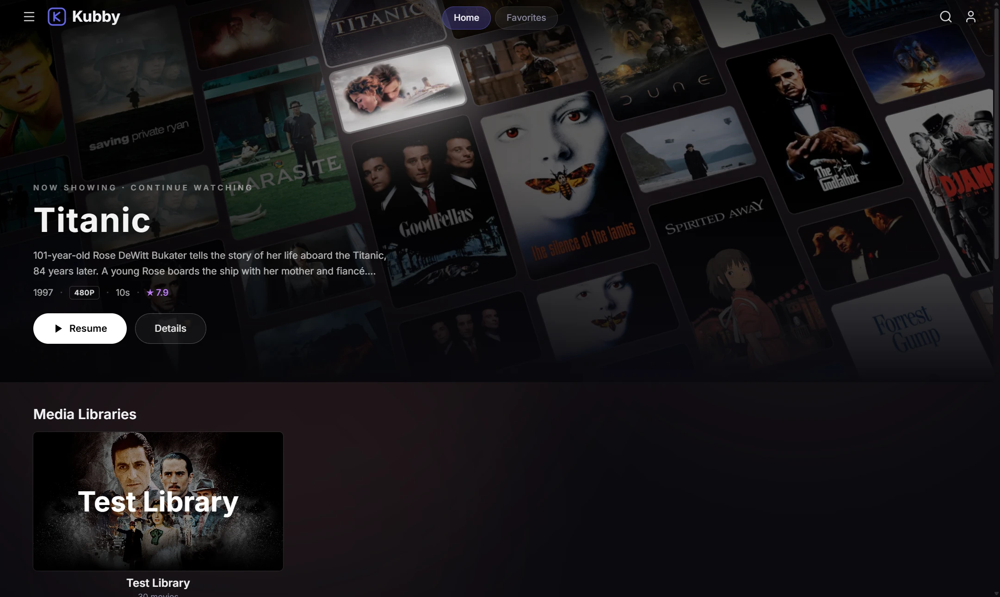

## 基础功能

- Jellyfin 风格的深色 UI，布局类似
- 直接兼容已有的 Jellyfin 和 Kodi 媒体库（NFO + 文件夹结构，不用重新整理）
- TMDB 刮削器，自动拉取元数据、海报、演员照片和传记
- 浏览器内播放，带进度记录，支持多碟电影
- HLS 转码 — 通过 FFmpeg 实时转封装/转码，在浏览器中播放 MKV、AVI、WMV、FLV、MOV、TS 等格式
- 全面支持移动端 — 手机浏览器即可浏览媒体库、观看视频（包括 VR 360° 全景），响应式 UI + 触控优化控件 + iOS/Android HEVC 硬解
- 中英文双语界面

## Kubby 独有的功能

### 唱片架式 Cover Flow 海报墙

全屏浏览模式,海报像唱片一样斜插排列,带镜面反射,滚轮/拖拽/键盘都能翻阅。支持按 8 个维度排序(评分、年份、分辨率、大小、时长等),切换排序时海报会飞行重排;分组分隔卡(年代、分辨率档、评分段)会根据当前排序自动生成。聚焦的海报下方会淡入一行简洁的字幕式信息,没有黑框,不遮挡画面。

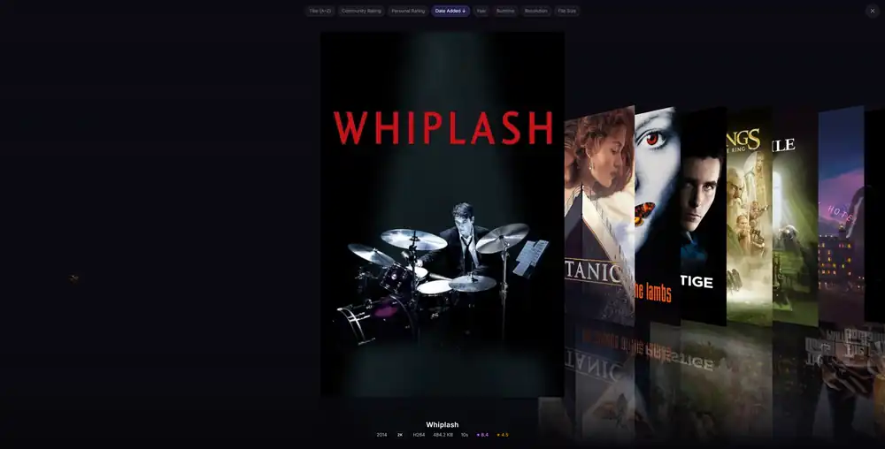

### 动态海报马赛克墙

首页打开就是一整面流动的海报马赛克——海报在 3D 空间里缓缓漂移,一束聚光灯轮流点亮最近添加的影片,每部都从墙面浮起,带上简介和元数据。既是屏保,也是入口。

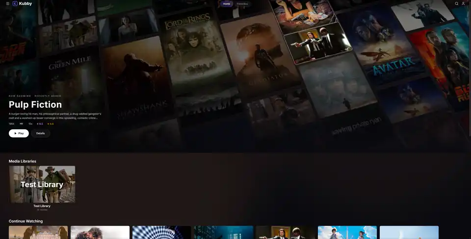

### 空间感 3D 界面

电影、演员、媒体库卡片会跟随鼠标做 3D 倾斜,背后带一层氛围光晕;点击海报会通过 View Transitions API 平滑变形进入详情页大图,而不是硬切换。详情页本身的头图也带滚动和指针驱动的视差效果。触屏设备和开启"减少动态效果"时会自动降级为静态展示。

### 360° VR 全景视频播放

在浏览器中直接观看 360° / VR 全景视频。播放器控制栏上有 360° 模式开关，开启后视频渲染到 Three.js 球体上，鼠标/触摸拖拽环顾四周，滚轮或双指缩放控制视野范围，按 `R` 重置视角。Three.js chunk (~500KB) 做了代码分离，只在 360° 模式激活时加载，不影响普通播放。桌面端和移动端都支持。

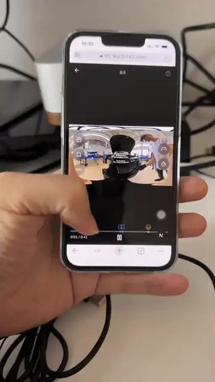

### VR 视频书签（保存视角）

360° 模式下创建的书签会同时保存时间戳和当前相机视角（经度、纬度、FOV）。缩略图截取的是你实际看到的画面，不是原始的全景展开图。从电影详情页或进度条点击 360° 书签时，会自动开启 360° 模式并恢复保存的视角——可以从特定角度回看特定瞬间。

### 自定义多维度评分

自己定义评分维度，例如电影可以按剧情、摄影、配乐打分，演员可以按颜值、演技打分。综合分会自动算出一个等级（SSS/S/A/B/...）显示在卡片上。整个片库可以按任意单个维度排序，找"摄影最好的电影"或"演技最强的演员"都是一键的事。

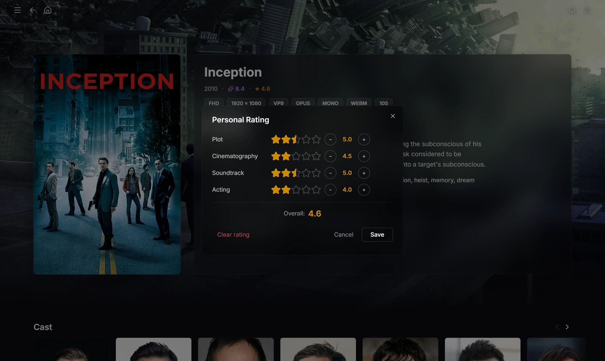

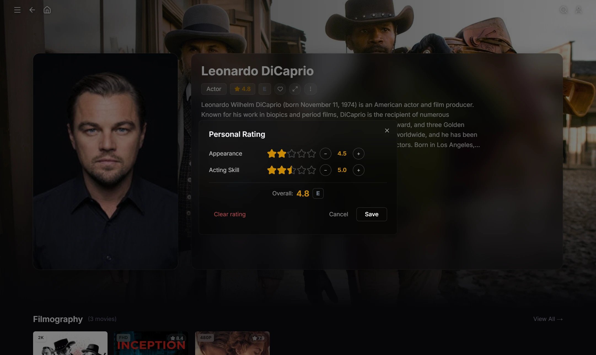

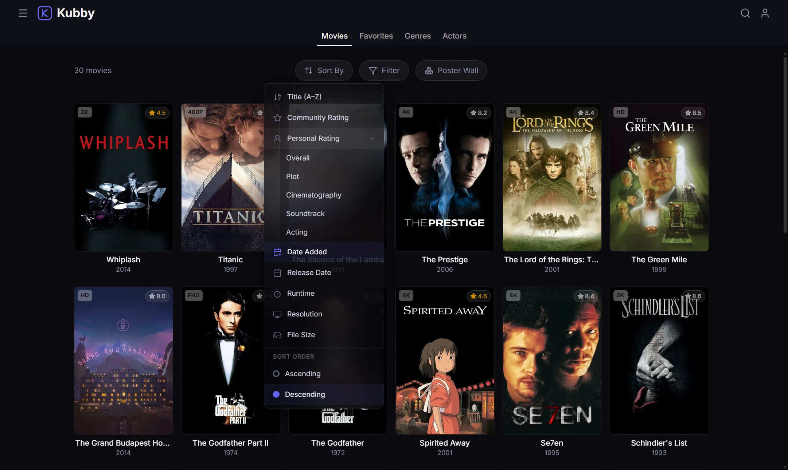

### 海报和演员徽章

卡片上直接显示个人评分、分辨率（4K/1080p 等）、演员等级。不想看的在设置里关掉就好。

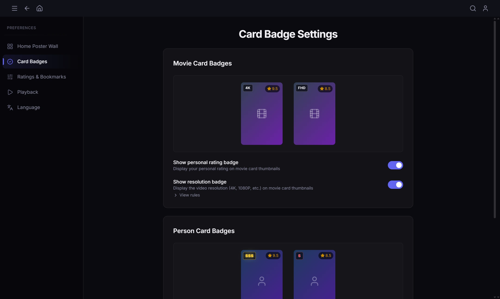

### 演员照片墙

给演员上传照片，瀑布流布局（类似 Google Photos），点开有灯箱查看器。

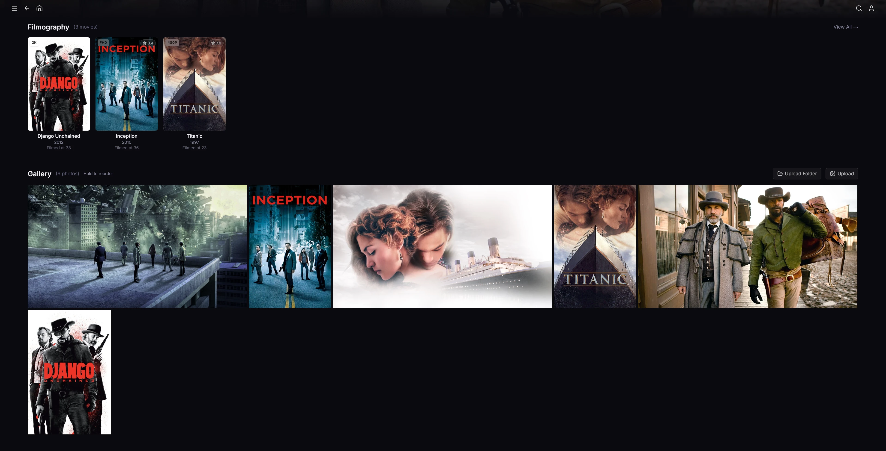

### 按出演年龄排序影片

演员详情页会显示每部电影出演时的年龄。按年龄排序可以追溯生涯轨迹，或者看看他们 25 岁和 45 岁时分别演了什么。

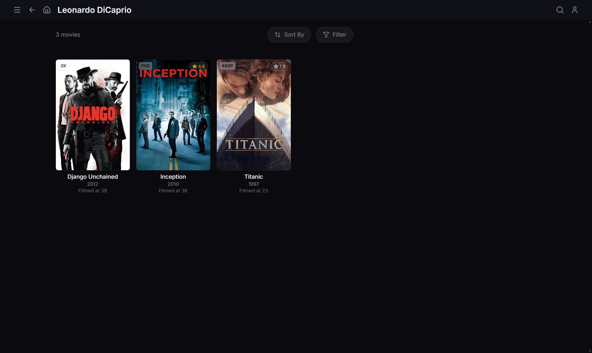

### 外部播放器

HEVC、DTS 这些浏览器放不了的格式，一键打开 IINA（macOS）或 PotPlayer（Windows）。支持本地文件播放和串流两种模式。

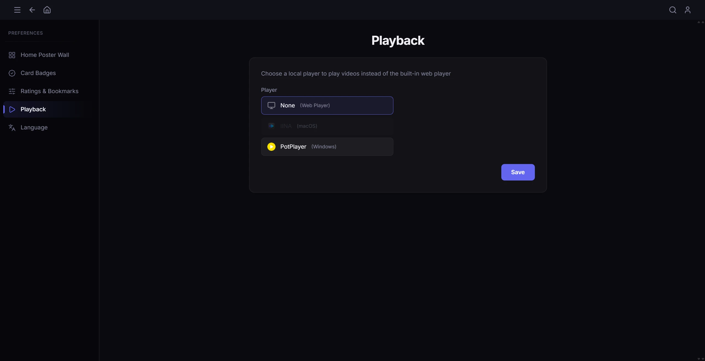

### 视频书签

播放时按 B 快速书签，Shift+B 可以选图标、加标签、写备注。进度条上会显示彩色圆点标记。内置 9 个图标，也可以自己上传。所有书签都能在电影详情页回看。

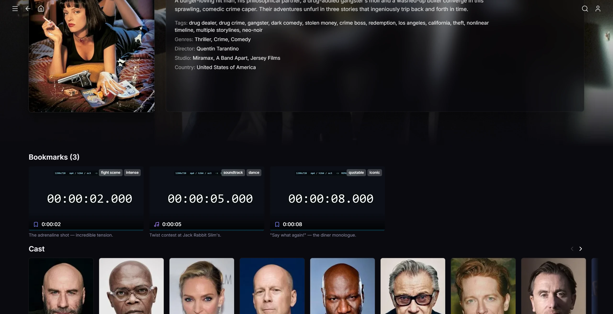

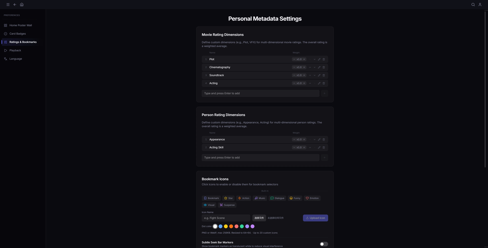

### 书签模式（帧浏览器）

VR 和高码率视频在浏览器里实时转码太卡。书签模式可以不播放视频，直接拖进度条逐帧浏览——服务端用 FFmpeg 提取单帧，1-2 秒出图。在电影详情页就能创建带图标、标签和备注的书签。还可以把任意一帧截图直接存到演员的照片墙里。

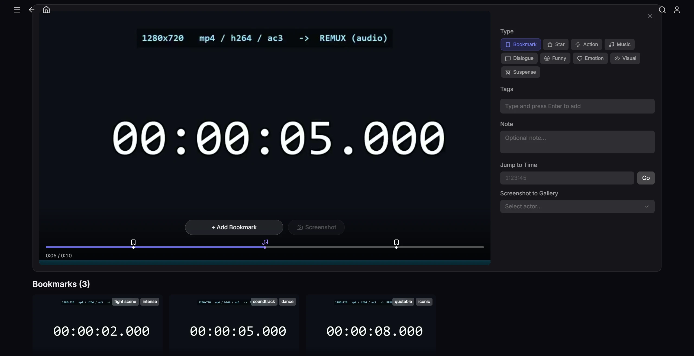

### 分类搜索

一个搜索框搜电影、演员和书签。想缩小范围的话按分类过滤。

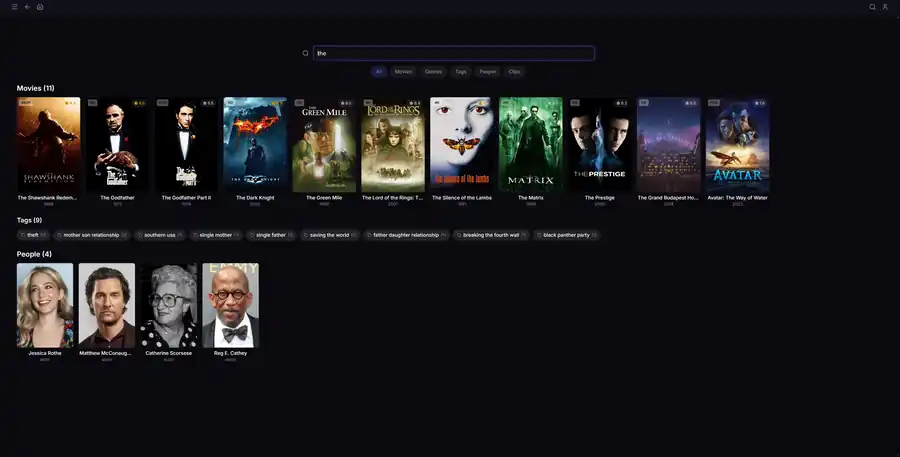

### Lazy loading

所有影片卡片和演员卡片均支持 lazy loading，替代 Jellyfin 的分页功能——这是一个 [2020 年就提出的 Jellyfin feature request](https://features.jellyfin.org/posts/216/remove-pagination-use-lazy-loading-for-library-view)，截至 2026 年 2 月仍未实现。

## 照片

把 Kubby 指向一个照片和视频文件夹，它会读取 EXIF 元数据，按拍摄时间构建媒体库。下面所有功能与电影侧共用同一套暗色主题，整个媒体收藏就像一个 app。

> 下方截图经过高斯模糊处理——演示库用的是个人照片。

### 时间线

按月份分组的虚拟滚动网格，横竖照片以自适应（justified）布局混排。数千张照片也能流畅滚动——只渲染可见的行。

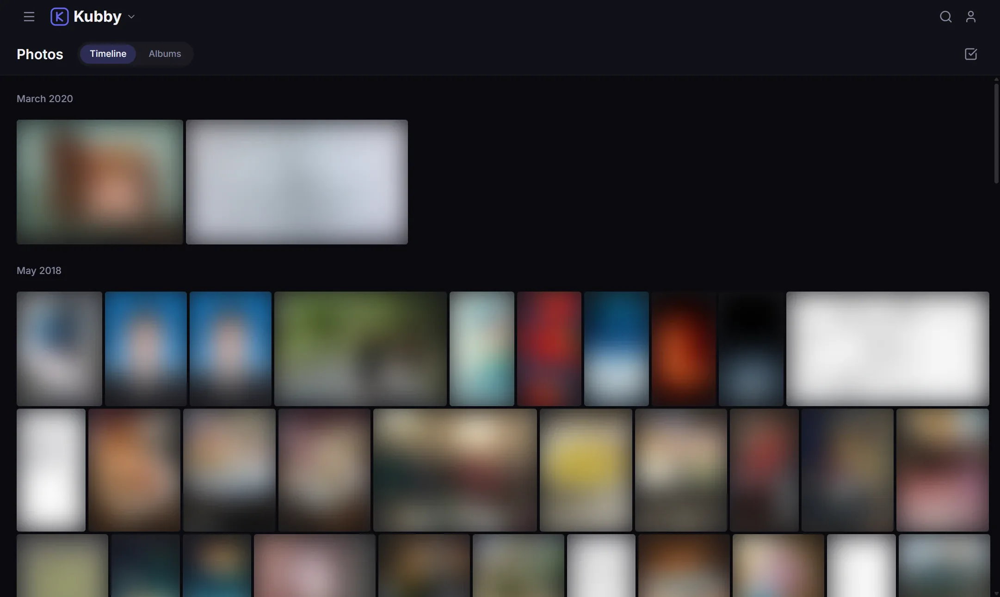

### 灯箱与 EXIF

点开任意照片进入全屏灯箱，支持上一张/下一张导航，右侧信息面板显示拍摄日期、尺寸和文件大小。视频可内联播放，一键下载原图。

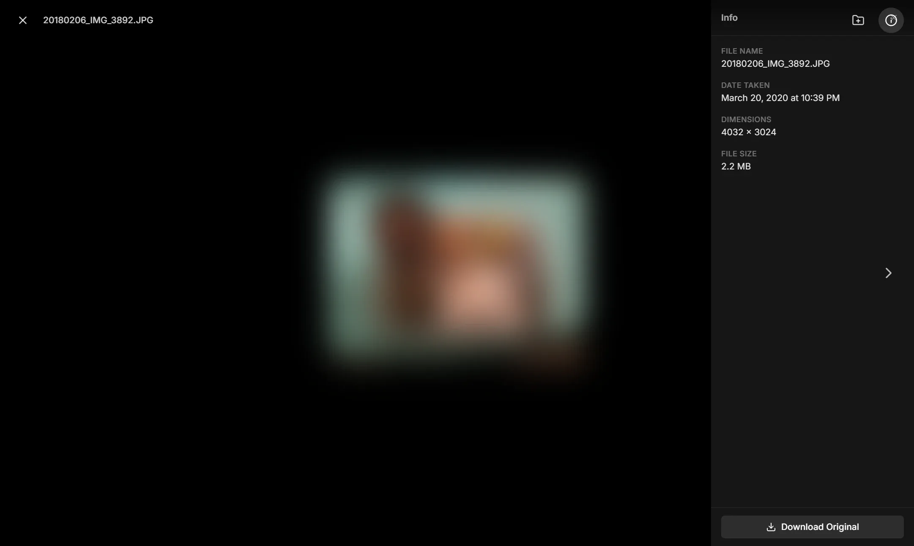

### 相册

把照片归入相册，每个相册有封面缩略图和数量统计。同一张照片可加入任意多个相册；相册本身不会复制或移动底层文件。

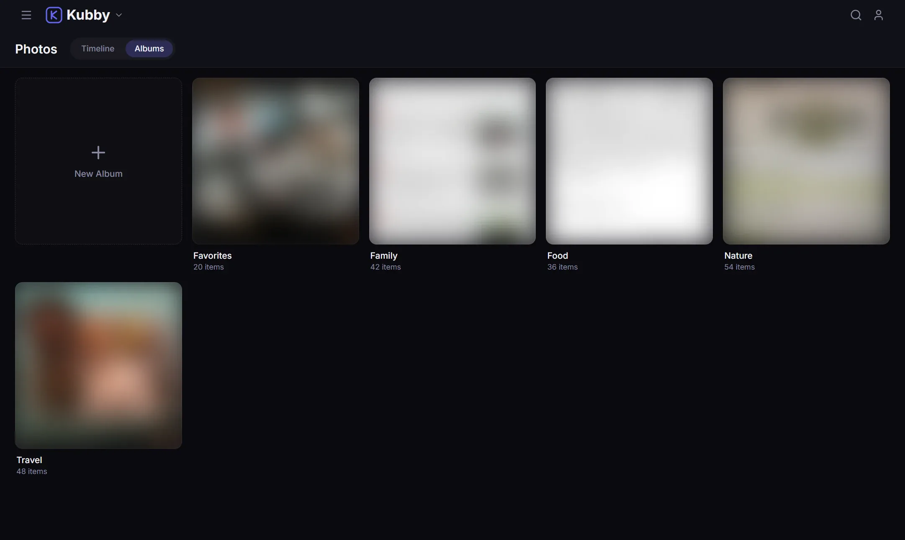

## 音乐

把 Kubby 指向一个音乐文件夹，它会读取内嵌标签（`music-metadata`）构建专辑 / 艺人 / 歌曲媒体库，封面取自内嵌图像或文件夹封面图。音频通过 HTTP Range 流式传输，浏览器无法直接播放的格式会走 ffmpeg→mp3 回退。

### 媒体库

按专辑、艺人或歌曲浏览，带「最近添加」栏和可排序的网格。扫描时会把符号连接的艺人名（feat.、×、/）拆分开（CJK 友好），让合作作品归到每位艺人名下。

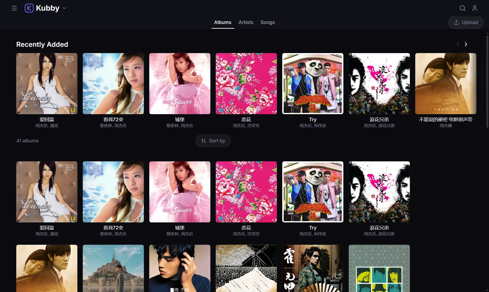

### 正在播放

QQ 音乐风格的全屏播放器：封面在黑胶唱片上旋转，时间轴同步的歌词在一侧滚动，频谱可视化悬浮在控制栏上方。浏览其他页面时，底部始终驻留一个紧凑的播放器。

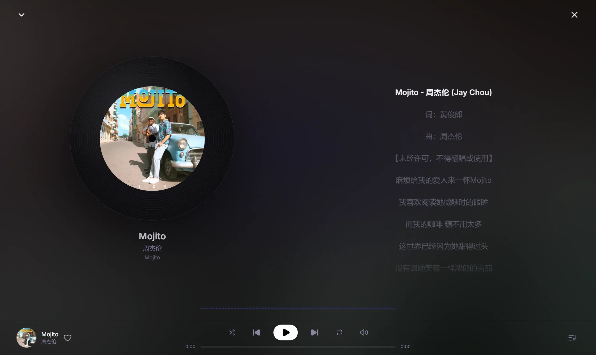

## 一个 app，三个媒体库

电影、照片、音乐各有自己的主页和导航，但共用同一套账户、主题和图片管线。Kubby 品牌处的域切换器可在它们之间跳转，并记住上次使用的域。无论你浏览哪个域，全局音乐播放器都会持续播放。

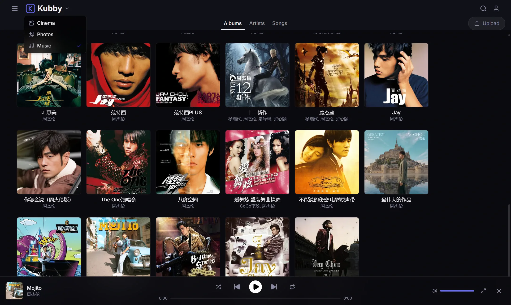

## 快速开始（开发）

```bash
npm install
npm run dev
```

打开 [http://localhost:8665](http://localhost:8665)，设置向导会引导你创建管理员账号和添加媒体库。

## 安装（macOS）

### 1. 下载

从 [Releases](https://github.com/lanceli93/kubby/releases) 页面下载 `Kubby.dmg`。

### 2. 安装

1. 双击 `Kubby.dmg` 打开
2. 把 **Kubby.app** 拖到 **Applications** 文件夹
3. 推出 DMG

### 3. 首次启动

macOS 默认会拦截未签名的应用。第一次打开 Kubby：

1. 打开 **Applications** 文件夹，**右键** Kubby → **打开**
2. 在弹窗里点 **打开**

只需要这一次。之后双击就能正常打开。

也可以：系统设置 → 隐私与安全性 → 往下翻 → 点 **仍要打开**。

### 启动后会发生什么

- 在 `http://localhost:8665` 跑起一个本地服务
- 自动打开浏览器
- Dock 栏和菜单栏（右上角）会出现 Kubby 图标
- 数据存在 `~/Library/Application Support/Kubby/`

### 退出

右键 Dock 里的 Kubby 图标 → **退出**，或者点菜单栏托盘图标 → **退出**。

### 卸载

1. 把 Kubby 从 Applications 拖到废纸篓
2. （可选）删除用户数据：`rm -rf ~/Library/Application\ Support/Kubby`

### 关于 macOS 门禁（Gatekeeper）

| 状态 | 用户体验 |
|------|---------|
| **未签名**（目前） | 弹出"无法打开"对话框，右键 → 打开可以绕过（一次） |
| **已签名**（Developer ID，$99/年） | 提示"来自已识别的开发者"，直接点打开就行 |
| **签名 + 公证** | 没有任何警告，跟 App Store 装的一样 |

## 安装（Windows）

### 1. 下载

从 [Releases](https://github.com/lanceli93/kubby/releases) 页面下载 `KubbySetup.exe`。

### 2. 安装

1. 双击 `KubbySetup.exe`
2. 跟着安装向导走（选安装路径 → 安装）
3. 在完成页面勾选 **启动 Kubby**

安装器会创建开始菜单和桌面快捷方式。

### 3. 首次启动

Windows SmartScreen 可能会对未签名应用弹出警告。点 **更多信息** → **仍要运行**。

### 启动后会发生什么

- 在 `http://localhost:8665` 跑起一个本地服务
- 自动打开浏览器
- 系统托盘（右下角）出现 Kubby 图标
- 数据存在 `%LOCALAPPDATA%\Kubby\`

### 退出

右键系统托盘里的 Kubby 图标 → **退出**。这会关掉所有后台进程（kubby.exe 和 node.exe）。

### 升级

跑一下新版的 `KubbySetup.exe` 就行。它会自动关掉正在运行的实例，覆盖安装，数据不会丢。

### 卸载

控制面板 → 程序和功能 → Kubby → 卸载。或者用开始菜单里的 **卸载 Kubby** 快捷方式。

用户数据在 `%LOCALAPPDATA%\Kubby\` 里会保留。想彻底删干净的话手动删一下。

## 安装（Docker / Linux / NAS）

支持 **amd64** 和 **arm64**。群晖、威联通、Unraid 和各种 Linux 服务器都能跑。

### Docker Compose（推荐）

```yaml
services:
  kubby:
    image: ghcr.io/lanceli93/kubby:latest
    ports:
      - "8665:8665"
    volumes:
      - kubby-data:/data
      - /path/to/your/movies:/media
    restart: unless-stopped

volumes:
  kubby-data:
```

```bash
docker compose up -d
```

打开 `http://<你的服务器IP>:8665`。

### Docker CLI

```bash
docker run -d \
  --name kubby \
  -p 8665:8665 \
  -v kubby-data:/data \
  -v /path/to/your/movies:/media \
  --restart unless-stopped \
  ghcr.io/lanceli93/kubby:latest
```

### 挂载目录

| 挂载点 | 用途 |
|--------|------|
| `/data` | 数据库、配置、日志、元数据（一定要持久化！） |
| `/media` | 你的媒体库文件夹（读写，Kubby 会往里面写 NFO 和海报文件） |

### 更新

```bash
docker compose pull && docker compose up -d
```

### 本地构建镜像

```bash
git clone <repo> && cd kubby
docker build -t kubby .
docker run -d -p 8665:8665 -v kubby-data:/data kubby
```

## 从源码构建

### 前置依赖

- Node.js 22+
- Go 1.25+
- npm

### 打包

```bash
npm install
npx tsx scripts/package.ts                       # macOS → Kubby.dmg
npx tsx scripts/package.ts --platform win-x64    # Windows → KubbySetup.exe
```

每个安装包大约 80-90 MB，里面包含：
- Go 启动器（系统托盘 + 进程管理）
- Node.js 运行时
- ffprobe 二进制文件
- Next.js 独立服务器

加 `--skip-build` 跳过 Next.js 重新构建，加 `--skip-download` 复用已缓存的二进制文件。Windows 包可以在 macOS 上交叉构建（原生模块会自动替换）。

### 跨平台打包

```bash
npx tsx scripts/package.ts --platform darwin-arm64   # macOS Apple Silicon
npx tsx scripts/package.ts --platform darwin-x64     # macOS Intel
npx tsx scripts/package.ts --platform win-x64        # Windows
```

## 技术栈

| 层 | 技术 |
|----|------|
| 框架 | Next.js 16 (App Router) + TypeScript |
| UI | shadcn/ui + Tailwind CSS v4 |
| 数据库 | SQLite (better-sqlite3, WAL 模式) + Drizzle ORM |
| 认证 | NextAuth.js v5 (Credentials + JWT) |
| 启动器 | Go (getlantern/systray) |

## 许可证

GPL-2.0
